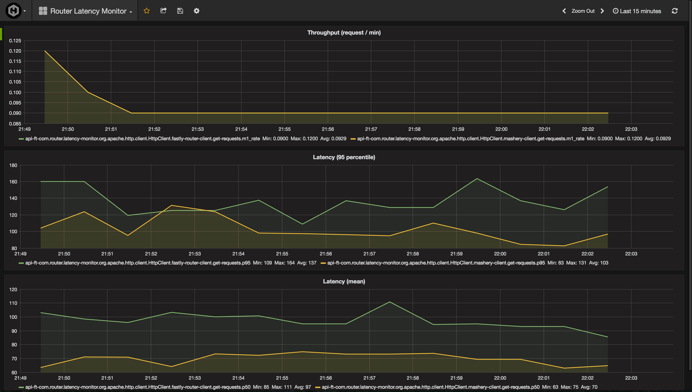
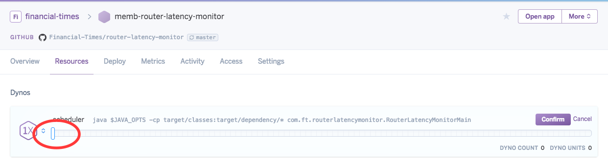

# router-latency-monitor

## What is this?
A simple tool to make HTTP requests on a configured set of endpoints, at
a configured frequency. The request metrics (throughput, latency etc) as
measured by the client are captured and pushed to a configured graphite 
instance.

The current instance is configured for a specific use-case to compare 
latency of the same backend system via different network routes. 

Specifically, we compare latency in hitting the same backend service
endpoints across 

* beta-api.ft.com (fastly router -> mashery g/w -> backend service nodes)
* api.ft.com (mashery g/w -> backend service nodes)

## Where are the endpoints configured?
Refer [APIFTCOMClient](src/main/java/com/ft/routerlatencymonitor/httpclient/APIFTCOMClient.java)
 
## Where is the frequency of requests configured?
Refer the `scheduler` section in [config.yaml](src/main/resources/config.yaml)

## Where does this tool run?
Currently configured to run as a [Heroku app - memb-router-latency-monitor](https://dashboard.heroku.com/apps/memb-router-latency-monitor) 
running in EU region.

## Where can I see the captured metrics?
The metrics can be seen in the configured 
[hostedgraphite instance - as a configured heroku app add-on](https://dashboard.heroku.com/apps/memb-router-latency-monitor/resources)

The following grafana dashboard also shows the important metrics in an 
easy to consume manner.

https://www.hostedgraphite.com/dabe343d/fd2b2f73-ee1b-4fc9-b782-8e3062fa524e/grafana/dashboard/db/router-latency-monitor

Below is a snapshot of what the dashboad looks like

## How do I shutdown the tool?

### Pre-requisite
You need `operate` access on [Heroku app - memb-router-latency-monitor](https://dashboard.heroku.com/apps/memb-router-latency-monitor)

### Steps
Simply scale the dynos down to 0

# References
* http://www.dropwizard.io/0.9.3/docs/manual/client.html
* http://www.dropwizard.io/0.9.2/docs/manual/configuration.html#graphite-reporter
* https://jersey.java.net/documentation/latest/client.html
* https://www.hostedgraphite.com/docs/metriclibraries/dropwizard.html